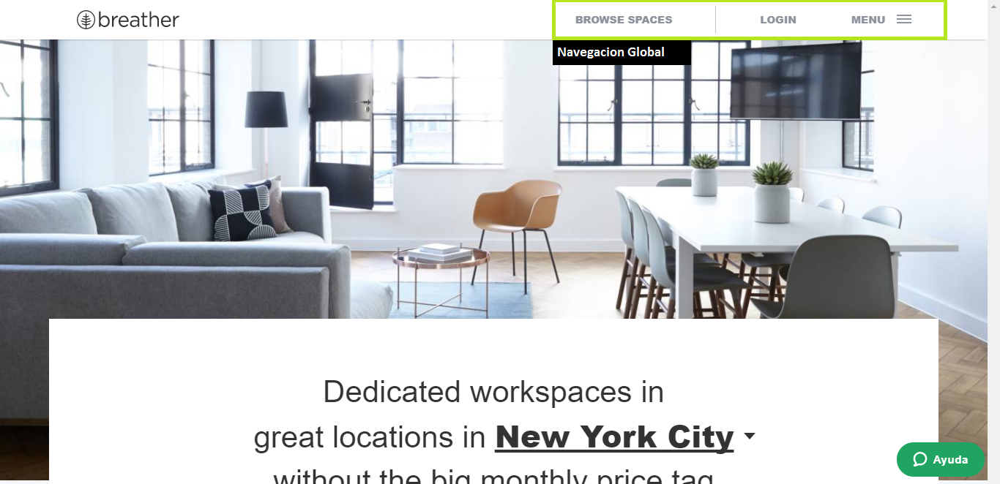
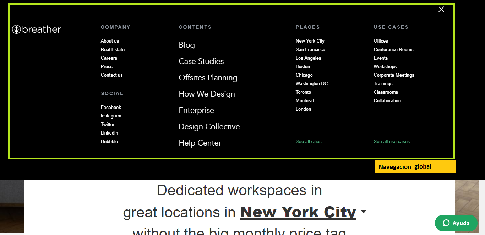
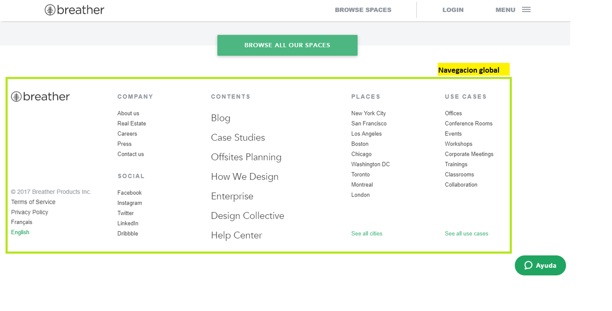
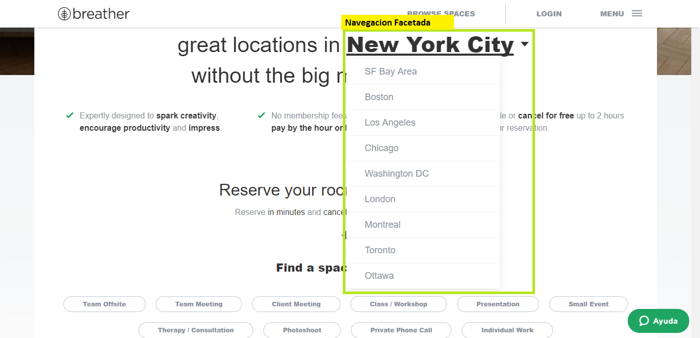
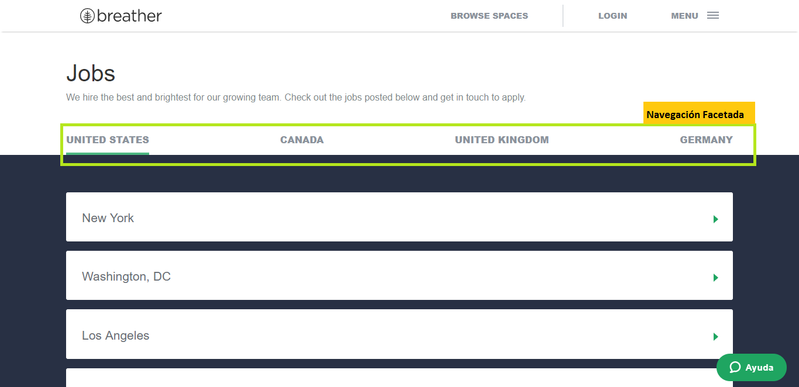
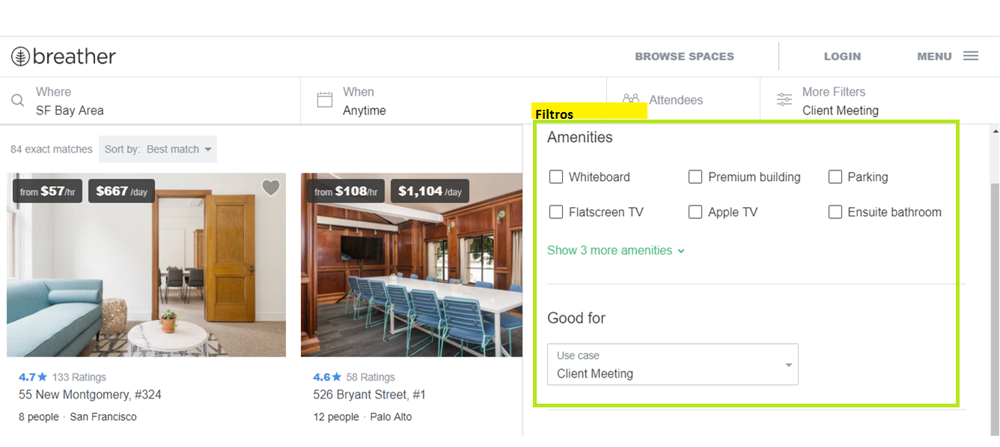

# BREATHER
## Identificando elementos de navegación

*Navegación global*  
En la siguientes figuras se muestran la ubicación de la navegación global en la pagina web.  
La navegación global es la navegación principal a traves de la cual podremos visitar toda la página. 

En esta figura observamos que la navegación global se encuentra en el encabezado de la pagina.

Al hacer click en el menu te muestra detalladamente toda la navegacion global para explorar el sitio.

En el pie de pagina observamos nuevamente la navegación global.

*Navegación facetada*  
Es la navegacion con filtros previamente definidos por el sistema.

*Filtros*  
Navegacion que me permite que el usurio pueda filtrar la información de acuerdo a sus requerimientos.

# GITHUB
## Identificando elementos de navegación

*Navegación global*

 

*Navegación local*  

*facetada* 

 

*filtrada*  

 

# MEDIUM
## Identificando elementos de navegación

*Navegación Global*  
La navegacion global es la navegación principal a traves de la cual podemos recorrer toda la página. En la siguiente figura identificamos la navegación global del sitio.

*Navegación facetada*  
En la siguiente figura se observa un filtro predeterminado por el sistema.

*Contextual*  
En la siguiente figura se muestra sugerencias de acuerdo al articulo que esta leyendo el usuario.

